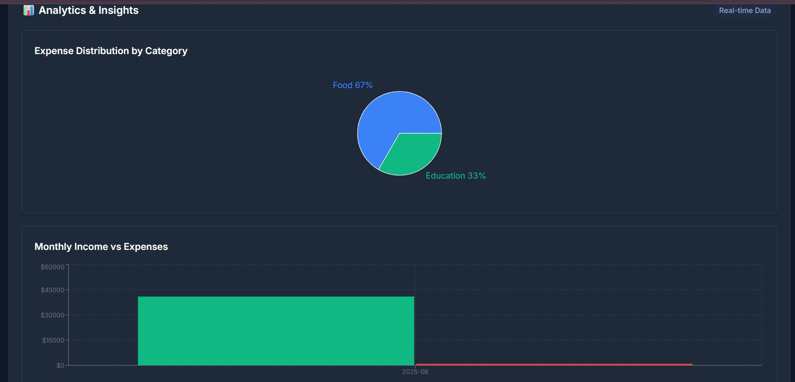

# 💰 Personal Finance Tracker

A full-stack React application with Node.js/Express backend and MongoDB database for tracking personal income and expenses with beautiful UI and analytics.


## ✨ Features

### 📊 **Core Functionality**
- **Add Transactions**: Easily add income and expense entries with title, amount, category, and type
- **Transaction Management**: View all transactions in a clean, organized list with delete functionality
- **Real-time Balance**: Dynamic calculation of total balance, income, and expenses
- **Smart Filtering**: Filter transactions by category or type (income/expense)
- **Database Persistence**: All data is saved to MongoDB database with full CRUD operations

### 🎨 **User Experience**
- **Dark/Light Mode**: Beautiful theme toggle with smooth transitions
- **Responsive Design**: Works perfectly on desktop, tablet, and mobile devices
- **Professional Icons**: Lucide React icons for a modern, clean interface
- **Smooth Animations**: Hover effects and transitions throughout the application

### 📈 **Advanced Analytics**
- **Expense Distribution Pie Chart**: Visual breakdown of spending by category
- **Monthly Income vs Expenses Bar Chart**: Compare income and expenses over time
- **Daily Spending Trends Area Chart**: Track spending patterns over the last 30 days
- **Real-time Updates**: Charts update instantly when transactions are added or removed
- **Interactive Tooltips**: Detailed information on hover with custom styling

### 🎯 **Categories & Types**
- **Income Categories**: Salary, Freelance, Investment, Business, Other
- **Expense Categories**: Food, Transportation, Entertainment, Shopping, Bills, Healthcare, Education, Other

## 🛠️ Tech Stack

### **Frontend**
- **React 19** - Modern React with hooks and functional components
- **Tailwind CSS 4** - Utility-first CSS framework for rapid UI development
- **Vite** - Fast build tool and development server
- **Lucide React** - Beautiful, customizable icons

### **Backend**
- **Node.js** - JavaScript runtime environment
- **Express.js** - Web application framework
- **MongoDB** - NoSQL database
- **Mongoose** - MongoDB object modeling
- **Helmet** - Security middleware
- **CORS** - Cross-origin resource sharing

### **Data Visualization**
- **Recharts** - Composable charting library built on React components
- **Responsive Charts** - Charts that adapt to different screen sizes
- **Custom Tooltips** - Professional tooltips with dark mode support

### **Development Tools**
- **ESLint** - Code linting and quality assurance
- **Git** - Version control
- **RESTful API** - Backend communication

## 🚀 Getting Started

### Prerequisites
- Node.js (version 16 or higher)
- npm or yarn package manager
- MongoDB (local installation or MongoDB Atlas)

### Installation

1. **Clone the repository**
   ```bash
   git clone <repository-url>
   cd Personal-Finance-Tracker
   ```

2. **Setup Backend**
   ```bash
   cd backend
   npm install
   ```

3. **Setup Frontend**
   ```bash
   cd ..
   npm install
   ```

4. **Configure Environment**
   - Copy `backend/config.env` to `backend/.env`
   - Update MongoDB connection string if needed

5. **Start MongoDB**
   - Start your local MongoDB service
   - Or use MongoDB Atlas cloud database

6. **Seed Database (Optional)**
   ```bash
   cd backend
   node seed.js
   ```

7. **Start Backend Server**
   ```bash
   cd backend
   npm run dev
   ```

8. **Start Frontend Development Server**
   ```bash
   npm run dev
   ```

9. **Open your browser**
   - Frontend: `http://localhost:5173`
   - Backend API: `http://localhost:5000`

### Build for Production
```bash
npm run build
```

### Preview Production Build
```bash
npm run preview
```

## 📁 Project Structure

```
Personal-Finance-Tracker/
├── src/                    # Frontend React code
│   ├── components/         # React components
│   │   ├── AddTransactionForm.jsx    # Form for adding new transactions
│   │   ├── TransactionList.jsx       # Display and manage transactions
│   │   ├── SummaryCard.jsx          # Balance, income, and expense cards
│   │   ├── FilterBar.jsx            # Filter transactions by category/type
│   │   ├── ThemeToggle.jsx          # Dark/light mode toggle
│   │   └── Charts.jsx               # Data visualization components
│   ├── services/          # API service layer
│   │   └── api.js         # Backend API communication
│   ├── App.jsx            # Main application component
│   ├── main.jsx           # Application entry point
│   └── index.css          # Tailwind CSS imports and custom styles
├── backend/               # Backend Node.js code
│   ├── models/            # MongoDB models
│   │   └── Transaction.js # Transaction schema
│   ├── routes/            # API routes
│   │   └── transactions.js # Transaction endpoints
│   ├── middleware/        # Express middleware
│   │   └── errorHandler.js # Error handling
│   ├── config/            # Configuration files
│   │   └── db.js          # Database connection
│   ├── server.js          # Main server file
│   ├── seed.js            # Database seeding script
│   └── package.json       # Backend dependencies
├── public/                # Static assets
├── index.html             # HTML template
├── tailwind.config.js     # Tailwind CSS configuration
├── vite.config.js         # Vite configuration
├── package.json           # Frontend dependencies and scripts
└── README.md              # Project documentation
```

## 🎨 Features in Detail

### **Responsive Design**
- Mobile-first approach with responsive breakpoints
- Optimized for all screen sizes (desktop, tablet, mobile)
- Touch-friendly interface with proper spacing
- Flexible grid layouts that adapt to content

### **Data Management**
- RESTful API communication with backend
- Real-time balance calculations
- Transaction filtering and sorting
- MongoDB database persistence
- Sample data seeding for immediate demonstration

### **Chart Analytics**
- **Pie Chart**: Shows expense distribution by category with percentages
- **Bar Chart**: Compares monthly income vs expenses with color coding
- **Area Chart**: Displays daily spending trends over time
- **Custom Tooltips**: Professional tooltips with formatted currency values
- **Responsive Charts**: All charts adapt to container size

### **Theme System**
- Smooth transitions between light and dark modes
- Persistent theme preference across sessions
- Consistent color scheme throughout the application
- Professional toggle switch with animated icons

## 🎯 Usage Guide

### **Adding Transactions**
1. Fill in the transaction title
2. Enter the amount
3. Select transaction type (Income/Expense)
4. Choose the appropriate category
5. Click "Add Transaction"

### **Managing Transactions**
- View all transactions in the main list
- Use filters to show specific categories or types
- Hover over transactions to reveal delete button
- Delete transactions by clicking the trash icon

### **Analyzing Data**
- View summary cards for quick insights
- Explore charts in the Analytics section
- Hover over chart elements for detailed information
- Use filters to analyze specific data subsets

### **Customizing Experience**
- Toggle between light and dark themes
- Add transactions to see real-time chart updates
- Filter data to focus on specific categories or time periods

## 🔧 Available Scripts

- `npm run dev` - Start development server with hot reload
- `npm run build` - Build for production
- `npm run preview` - Preview production build locally
- `npm run lint` - Run ESLint for code quality

## 📱 Browser Support

- Chrome (latest)
- Firefox (latest)
- Safari (latest)
- Edge (latest)

## 🎓 Learning Outcomes

This project demonstrates proficiency in:

### **Frontend Development**
- Modern React patterns and hooks
- Component-based architecture
- State management with useState and useEffect
- Event handling and form management

### **UI/UX Design**
- Responsive design principles
- Accessibility considerations
- User experience optimization
- Professional visual design

### **Data Visualization**
- Chart library integration
- Data processing and transformation
- Interactive visualizations
- Real-time data updates

### **Technical Skills**
- Modern JavaScript (ES6+)
- CSS frameworks and utility classes
- Build tools and development workflow
- Code organization and best practices

## 🤝 Contributing

This project was developed as an internship showcase. Feel free to:
- Report bugs or issues
- Suggest new features
- Submit improvements
- Fork and modify for your own projects

## 📄 License

This project is open source and available under the [MIT License](LICENSE).

## 🙏 Acknowledgments

- **React Team** - For the amazing framework
- **Tailwind CSS** - For the utility-first CSS framework
- **Recharts** - For the powerful charting library
- **Lucide** - For the beautiful icon set
- **Vite** - For the fast build tool

---

**Built with ❤️ for internship showcase**

*This project demonstrates modern web development skills including React, data visualization, responsive design, and user experience optimization.*

## 🖼 Demo Screenshots

<!-- ### Light Mode -->


.jpg)


